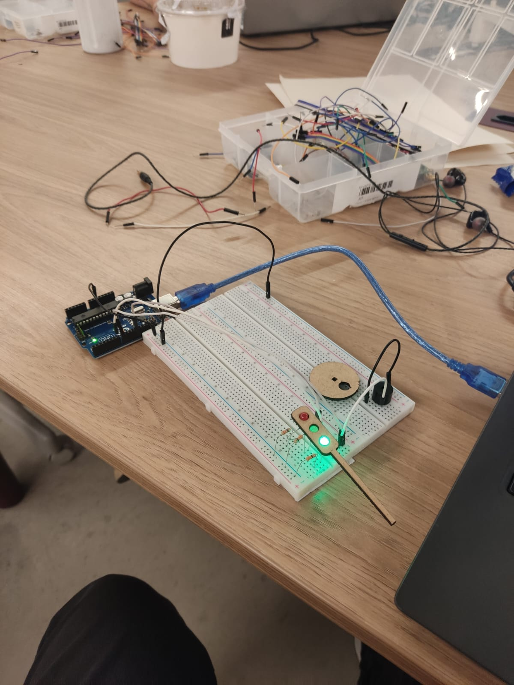

# Atendimento do Semafáro 


<p align="center">
<h3 align="center">Montagem Física do Semáforo</h3>
    
</p>


<h4 align="center">Protoboard com LEDs conectados</h4>


## 1. Ideação e Planejamento Inicial

Como estudante de eletrônica e programação, meu objetivo com este projeto foi simular o funcionamento de um semáforo usando o Arduino, incluindo LEDs coloridos para representar as luzes do semáforo: vermelho, amarelo e verde. A ideia inicial foi montar um circuito em uma protoboard que pudesse ser conectado ao Arduino, controlando as luzes através de um código que representasse o fluxo de um sinal de trânsito real.

Inicialmente, pensei em como cada LED precisaria estar corretamente conectado ao Arduino para funcionar de forma sequencial. Planejei que cada LED tivesse seu próprio pino digital no Arduino para garantir que o controle individual fosse possível.

Para evitar interferências e garantir segurança ao circuito, decidi incluir um resistor de 330 ohms em série com cada LED, o que é essencial para evitar sobrecarga de corrente nos LEDs. Uma vez com esses conceitos no lugar, foi só passar para o desenvolvimento da lógica no código para o funcionamento do semáforo.

Durante o desenvolvimento, identifiquei duas funcionalidades extras que poderiam aprimorar o projeto:
1. **Substituir `delay()` por `millis()`** - Percebi que, ao usar `delay()`, o Arduino ficava bloqueado e isso impediria a implementação de funções adicionais no futuro. Optei pelo `millis()`, que permite contar o tempo sem interromper o funcionamento do programa, permitindo maior flexibilidade para adicionar outras funções.
2. **Incluir um Buzzer** - Para tornar o projeto mais inclusivo, decidi adicionar um buzzer que emite um som quando o LED verde acende. Isso simula uma funcionalidade real de semáforos que utilizam sinais sonoros para ajudar pessoas cegas a identificar quando o sinal está aberto para travessia.

## 2. Especificações do Projeto

- **Componentes Usados**:
  - Arduino Uno
  - Protoboard
  - LEDs (vermelho, amarelo e verde)
  - Resistores de 330 ohms para cada LED
  - Buzzer
  
- **Objetivo do Projeto**: 
  - Simular o funcionamento de um semáforo, com a sequência de cores representando o fluxo de trânsito, além de incluir um sinal sonoro (buzzer) no LED verde para indicar a travessia para deficientes visuais.

## 3. Explicação do Código

Abaixo está o código final com as explicações de cada etapa:

```cpp
// Definindo os pinos em que os LEDs e o buzzer vão estar conectados no Arduino
int ledVermelho = 8;
int ledAmarelo = 7;
int ledVerde = 12;
int buzzer = 6; // Pino do buzzer

// Definindo os tempos para cada LED em milissegundos
const unsigned long tempoVermelho = 6000; // 6 segundos
const unsigned long tempoAmarelo = 2000;  // 2 segundos
const unsigned long tempoVerde = 2000;    // 2 segundos
const unsigned long tempoPiscaVermelho = 500; // Pisca o LED vermelho por 500 ms no final

// Variáveis de controle
unsigned long tempoInicial = 0;
int estadoAtual = 0; // 0 = vermelho, 1 = amarelo, 2 = verde, 3 = amarelo, 4 = pisca vermelho

void setup() {
  pinMode(ledVermelho, OUTPUT);
  pinMode(ledAmarelo, OUTPUT);
  pinMode(ledVerde, OUTPUT);
  pinMode(buzzer, OUTPUT);

  // Inicia o ciclo com o LED vermelho aceso
  digitalWrite(ledVermelho, HIGH);
  tempoInicial = millis(); // Armazena o tempo inicial
}

void loop() {
  // Calcula o tempo decorrido desde o início do estado atual
  unsigned long tempoDecorrido = millis() - tempoInicial;

  switch (estadoAtual) {
    case 0: // LED vermelho ligado por 6 segundos
      if (tempoDecorrido >= tempoVermelho) {
        digitalWrite(ledVermelho, LOW);  // Apaga o LED vermelho
        digitalWrite(ledAmarelo, HIGH);  // Liga o LED amarelo
        estadoAtual = 1;                 // Passa para o próximo estado
        tempoInicial = millis();         // Atualiza o tempo inicial
      }
      break;

    case 1: // LED amarelo ligado por 2 segundos
      if (tempoDecorrido >= tempoAmarelo) {
        digitalWrite(ledAmarelo, LOW);   // Apaga o LED amarelo
        digitalWrite(ledVerde, HIGH);    // Liga o LED verde
        digitalWrite(buzzer, HIGH);      // Liga o buzzer para indicar travessia
        estadoAtual = 2;                 // Passa para o próximo estado
        tempoInicial = millis();         // Atualiza o tempo inicial
      }
      break;

    case 2: // LED verde ligado por 2 segundos
      if (tempoDecorrido >= tempoVerde) {
        digitalWrite(ledVerde, LOW);     // Apaga o LED verde
        digitalWrite(buzzer, LOW);       // Desliga o buzzer
        digitalWrite(ledAmarelo, HIGH);  // Liga o LED amarelo novamente
        estadoAtual = 3;                 // Passa para o próximo estado
        tempoInicial = millis();         // Atualiza o tempo inicial
      }
      break;

    case 3: // LED amarelo ligado por 2 segundos novamente
      if (tempoDecorrido >= tempoAmarelo) {
        digitalWrite(ledAmarelo, LOW);   // Apaga o LED amarelo
        digitalWrite(ledVermelho, HIGH); // Liga o LED vermelho para iniciar o piscar
        estadoAtual = 4;                 // Passa para o estado de piscar
        tempoInicial = millis();         // Atualiza o tempo inicial
      }
      break;

    case 4: // Pisca o LED vermelho (liga e desliga em intervalos de 500 ms)
      if (tempoDecorrido >= tempoPiscaVermelho) {
        digitalWrite(ledVermelho, !digitalRead(ledVermelho)); // Alterna o LED vermelho
        tempoInicial = millis();  // Atualiza o tempo inicial para o próximo ciclo de piscagem

        // Após duas piscadas completas (ON e OFF duas vezes), reinicia o ciclo
        if (digitalRead(ledVermelho) == LOW) { // Verifica se terminou o ciclo de piscagem
          estadoAtual = 0; // Volta para o estado inicial (LED vermelho ligado)
          digitalWrite(ledVermelho, HIGH);
          tempoInicial = millis(); // Atualiza o tempo inicial para o novo ciclo
        }
      }
      break;
  }
}
```

### Vídeo demonstrativo:

[Clique aqui](https://youtube.com/shorts/i241hhGlGFI?feature=share) para ver o vídeo demonstrativo


### Tabela de Avaliação entre Pares


### Avaliação do meu colega em relação à mim


#### Avaliador: Ryan Gartlan | Avaliado: David Deodato

|Critério|	Contempla (Pontos)|	Contempla Parcialmente (Pontos)	|Não Contempla (Pontos)	|Observações do Avaliador|
|-|-|-|-|-|
|Montagem física com cores corretas, boa disposição dos fios e uso adequado de resistores	| 3	| 0 |0 |fez a montagem correta, nas cores corretas e boa disposição dos fios |	
|Temporização adequada conforme tempos medidos com auxílio de algum instrumento externo	| 3	|0	|0 | usou o milis para medir o tempo, fazendo um temporizador |	
|Código implementa corretamente as fases do semáforo e estrutura do código (variáveis representativas e comentários) | 3| 0 |	0 | fez a sequência correta e ainda validou com o professor |	
|Ir além: Implementou um componente de extra, fez com millis() ao invés do delay() e/ou usou ponteiros no código | 1 | 0  | 0 | usou millis e usou buser |	
| | | | |*Pontuação Total = 10* |


### Avaliação do meu outro colega em relação à mim

#### Avaliador: Daniel Dias | Avaliado: David Deodato


|Critério|  Contempla (Pontos)| Contempla Parcialmente (Pontos) |Não Contempla (Pontos) |Observações do Avaliador|
|-|-|-|-|-|
|Montagem física com cores corretas, boa disposição dos fios e uso adequado de resistores   | 3 | - |- | Montou corretamente os resistores e fez uso das cores corretamente (usou jumpers brancos por conta de não possuir jumpers vermelhor para representar corretamente, mas justificou que o professor indicou ) |
|Temporização adequada conforme tempos medidos com auxílio de algum instrumento externo | 3 | - | - | Fiz uso de um cronômetro para marcar o tempo e verificar se o tempo está condizente com a proposta da ponderada |
|Código implementa corretamente as fases do semáforo e estrutura do código (variáveis representativas e comentários) |3|    - | - |Sim, notei a presença de muitos comentários por todo o código, bem explicativos |
|Ir além: Implementou um componente de extra, fez com millis() ao invés do delay() e/ou usou ponteiros no código | 1 | - | - |Usou millis() no código e adicionou um buzzer
| | | | |Pontuação Total: 10|


### Minha avaliação em relação ao meu colega

#### Avaliador: David Deodato | Avaliado: Ryan Gartlan


|Critério|	Contempla (Pontos)|	Contempla Parcialmente (Pontos)	|Não Contempla (Pontos)	|Observações do Avaliador|
|-|-|-|-|-|
|Montagem física com cores corretas, boa disposição dos fios e uso adequado de resistores	| 3	| 0 |0 |fez a montagem correta, nas cores corretas e boa disposição dos fios, deixando claro quais são quais |	
|Temporização adequada conforme tempos medidos com auxílio de algum instrumento externo	| 3	|0	|0 | usou o miles para medir o tempo |	
|Código implementa corretamente as fases do semáforo e estrutura do código (variáveis representativas e comentários) | 3| 0 |	0 | fez a sequência correta |	
|Ir além: Implementou um componente de extra, fez com millis() ao invés do delay() e/ou usou ponteiros no código |	0 | 0  |	0 | não foi além |	
| | | | |Pontuação Total = 9 |


### Minha avaliação em relação ao meu colega 2

#### Avaliador: David Deodato | Avaliado: Daniel Dias

|Critério|	Contempla (Pontos)|	Contempla Parcialmente (Pontos)	|Não Contempla (Pontos)	|Observações do Avaliador|
|-|-|-|-|-|
|Montagem física com cores corretas, boa disposição dos fios e uso adequado de resistores	| 3	| 0 |0 |fez a montagem correta, nas cores corretas e boa disposição dos fios |	
|Temporização adequada conforme tempos medidos com auxílio de algum instrumento externo	| 3	|0	|0 | usou o milis para medir o tempo, fazendo um temporizador |	
|Código implementa corretamente as fases do semáforo e estrutura do código (variáveis representativas e comentários) | 3| 0 |	0 | fez a sequência correta e ainda validou com o professor |	
|Ir além: Implementou um componente de extra, fez com millis() ao invés do delay() e/ou usou ponteiros no código | 1 | 0  | 0 | usou millis e usou buzzer |	
| | | | |*Pontuação Total = 10* |